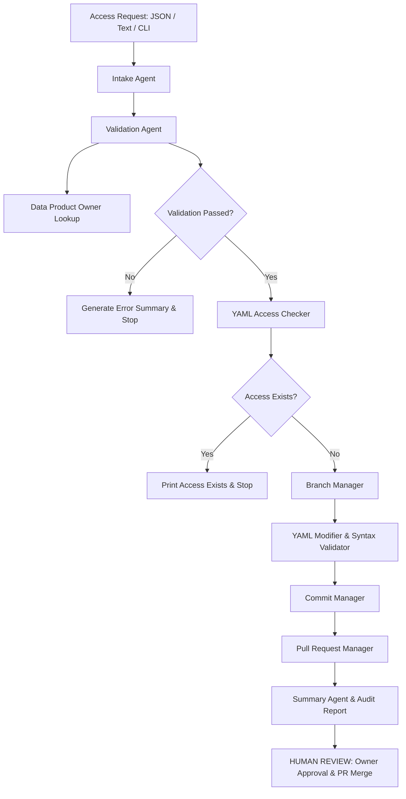

# System Architecture & Component Design

## Overview

The **AI-assisted GitOps Access Provisioning Agent** POC bridges enterprise access request intake with version-controlled GitOps governance.

## Component Breakdown

### 1. Agentic Intake & Normalization Layer
- **`IntakeAgent`**: Parses structured JSON payload or applies regex pattern matching to extract fields from natural language tickets.
- **`ValidationAgent`**: Applies domain rules (prefix checks, environment whitelist, scope whitelist) and queries ownership metadata.
- **`SummaryAgent`**: Synthesizes pipeline execution outputs into clean, human-readable terminal reports and governance reminders.

### 2. Core Business & Logic Layer
- **`normalizer.py`**: Enforces naming standards (`DS-` / `CADP-`), strips `_LH` / `-LH` suffixes, replaces `_` with `-`, and constructs `access_type` (`dev_to_prod`).
- **`validator.py`**: Ensures all mandatory fields are present and conform to enterprise policies.
- **`owner_lookup.py`**: Resolves data product owners from `config/owner_mapping.csv` or file header metadata.
- **`yaml_access_checker.py`**: Scans target provider YAML manifest (`sample_repo/data_products/<provider>.yaml`) for existing permissions.
- **`yaml_modifier.py`**: Uses `ruamel.yaml` to append new permission entry with `status: pending_pr` while preserving formatting and comments, validating syntax before writing.

### 3. GitOps Automation Layer
- **`github_client.py`**: Handles GitHub API authentication via PyGithub or gracefully falls back to simulation mode.
- **`branch_manager.py`**: Constructs branch name `feature/<request_id>-<access_type>-access` and provisions branch.
- **`commit_manager.py`**: Commits modified YAML file.
- **`pr_manager.py`**: Creates GitHub Pull Request with Markdown body detailing request metadata and governance checklist.
